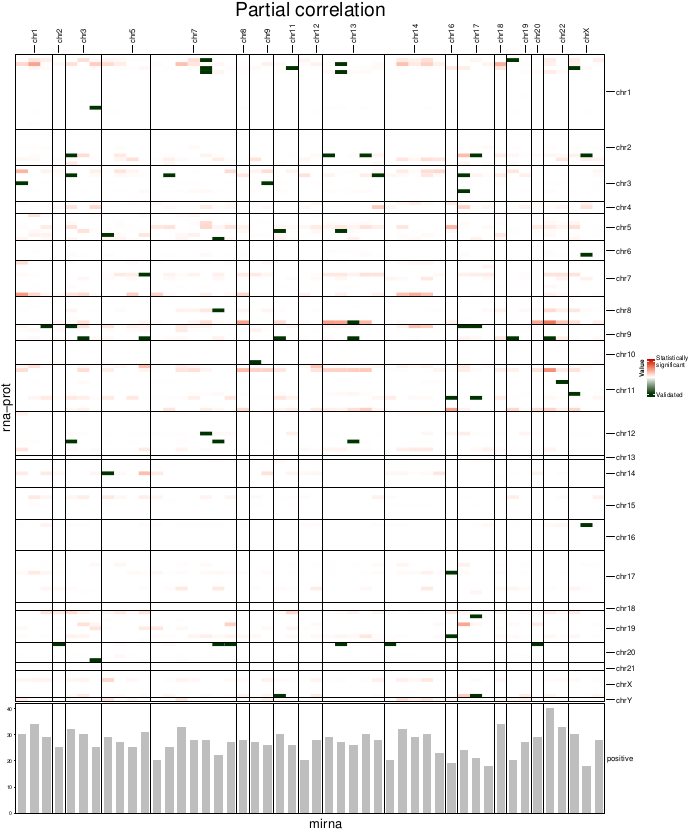

<!-- README.md is generated from README.Rmd. Please edit that file -->

```{r, include = FALSE}
knitr::opts_chunk$set(
  collapse = TRUE,
  comment = "#>",
  fig.path = "man/figures/README-",
  out.width = "100%"
)
```

# MoPc: Multi-omics Partial correlation analysis

<!-- badges: start -->
<!-- badges: end -->

MoPc (Multi-omics partial correlation analysis) is software to reveal the miRNA drivers of a biological process in a multi-omics dataset, starting from the expression matrices of mRNA, proteomics, and miRNA.

In the presence of such matrices, the canonical approach to identify miRNA drivers consists in carrying out the mRNA-miRNA correlation (mRNA and miRNA matrices) and proteomics-miRNA (proteomics and miRNA matrices).

Although this approach has proved effective, MoPc introduces the partial correlation measurement between the mRNA and proteomic matrices, conditioned on the expression of miRNAs. In particular, MoPc selects as a driver the miRNAs in which the partial correlation p-value is better (therefore lower) than the bivariate mRNA-proteomic correlation p-value.
The tool also verifies the enrichment of the mRNA-miRNA pairs found with what is already available in the literature in three well-known databases: mirDB, TargestScan, mirTarbase.

## Installation

You can install the development version of MoPc from [GitHub](https://github.com/) with:

``` r
# install.packages("devtools")
devtools::install_github("martalovino/MoPc")
```

## Why should you use MoPc
MoPc identifies the miRNA drivers starting from a multi-omic dataset composed of:

* mRNA expression matrix
* proteomic expression matrix
* miRNA expression matrix
exploiting the partial correlation between mRNA and proteomics conditioned on the expression of miRNAs.


## Input
To run MoPc you need:

* mRNA expression matrix;
* proteomic expression matrix;
* miRNA expression matrix.

You can find a sample dataset directly inside the package, which you can easily replace with your data.

## Output
The MoPc output consists of:

* A list with all the drivers found, with their enrichment;
* A map with all the miRNA drivers found in the dataset (in red, those enriched in at least one of mirDB, TargestScan, mirTarbase);
* A report of the enrichment values in the three databases mirDB, TargestScan, mirTarbase by hypergeometric test.

Please, see the example below.

## Example

Below you will find an illustrative example of the input data and the tool's output.
The tool consists of several parts:

* Setup and parameters setting;
* Data loading and preprocessing;
* Core part of the tool: partial correlation computation, and validation information;
* Plot correlation;
* Hypergeometric test;
* Plots, validation and hypergeometric test on bivariate correlation mRNA-mirna and prot-miRNA


### Setup and parameters setting
This part loads the package and set proper hyper-parameters.

```{r}
library(MoPc)

# Parameters
corr_method <- "pearson"
mat1_name <- "rna"
mat2_name <- "prot"
mat3_name <- "mirna"
ncores = 7
fdr_th <- 0.05
improvement_th <- 0
out_folder <- "results"
dir.create(out_folder, showWarnings = FALSE)
```

### Data loading and preprocessing
This part loads some sample data to work with and performs basic preprocessing.

```{r}
# load breast cancer dataset
data(rna)
data(prot)
data(mirna)


# minimalist preprocecessing: selecting only common samples and common genes
# between rna and prot
d <- minimalist_preproc(rna, prot, mirna)

# annotate and sort genes/mirnas by chromosomal order
rna <- annotate_genes(d$mat1)
prot <- annotate_genes(d$mat2)
mirna <- annotate_mirnas(d$mat3)

#-------------------------------------------------------------------------------
# DEFINING ROWS and COLUMNS of partial correlation matrix
# usually genes on the rows and mirnas or CNAs on the columns
#-------------------------------------------------------------------------------
genes_proteins <- rownames(rna$data)
condv <- rownames(mirna$data)
gene_annot <- rna$annot
condv_annot <- mirna$annot
```

### Core part of the tool: partial correlation computation, and validation information
This is the core part of the tool. It contains the partial correlation computation and the validation information.

```{r}
#-------------------------------------------------------------------------------
# PARTIAL CORRELATION COMPUTAION
#-------------------------------------------------------------------------------
a <- compute_pc_values(rna$data, prot$data, mirna$data, corr_method, out_folder, ncores)

mat <- get_relevant_improvement(rna$data, prot$data, a$pval, corr_method, improvement_th)
th <- quantile(unlist(mat[!is.na(mat)]), 0.75)
mat <- get_relevant_improvement(rna$data, prot$data, a$pval, corr_method, th)


#-------------------------------------------------------------------------------
# GET VALIDATION info
#-------------------------------------------------------------------------------
valid <- validation_info(mat, condv, genes_proteins, 7)
```

The list with all the drivers found, with their enrichment is available in the valid object.

```{r}
head(valid$to_validate)
```

### Plot correlation
Main plot of the package. 

```{r}
#-------------------------------------------------------------------------------
# PARTIAL CORRELATION PLOT
#-------------------------------------------------------------------------------
partial_corr_heatmap_plot(valid$to_validate, genes_proteins, condv, gene_annot, condv_annot,
                          mat, out_folder)
```

{width=100%}

### Hypergeometric test
This section computes the hypergeometric test to ensure the enrichment in the three databases: mirDB, TargetScan, mirTarBase.
The hypergeometric test results are written in the *hypergeometric_test_results.txt* report file.

```{r}
#-------------------------------------------------------------------------------
# Computing enrichment significance in mirDB, TargetScan, mirtarBase
#-------------------------------------------------------------------------------
hyper_test(valid$to_validate, valid$universe, valid$mirDB, valid$ts, valid$tarbase, file.path(out_folder, "hypergeometric_test_results.txt"))
```

### Plots, validation and hypergeometric test on bivariate correlation mRNA-mirna and prot-miRNA
This part loads the package and set proper hyper-parameters.

```{r}
#-------------------------------------------------------------------------------
# Get plots and results on mrna-mirna and prot-mirna correlations
#-------------------------------------------------------------------------------
st_corr_mrna_mirna <- heatmap_corr(rna$data, mirna$data, mat1_name, mat3_name,
                                   condv_annot, gene_annot,
                                   file.path(out_folder, "mRNA-miRNA"))

st_corr_prot_mirna <- heatmap_corr(prot$data, mirna$data, mat2_name, mat3_name,
                                   condv_annot, gene_annot,
                                   file.path(out_folder, "prot-miRNA"))

#-------------------------------------------------------------------------------
# Validating mrna-mirna and prot-mirna correlations
#-------------------------------------------------------------------------------
to_validate_mrna <- st_corr_mrna_mirna$table[st_corr_mrna_mirna$table$pvaluefdrcorr < fdr_th,]
valid_mrna <- validation_info(to_validate_mrna, condv, genes_proteins, 7, from_cor_mat = FALSE)

hyper_test(valid_mrna$to_validate, valid_mrna$universe, valid_mrna$mirDB, valid_mrna$ts, valid_mrna$tarbase, file.path(out_folder, "mRNA_hypergeometric_test_results.txt"))


to_validate_prot <- st_corr_prot_mirna$table[st_corr_prot_mirna$table$pvaluefdrcorr < fdr_th,]
valid_prot <- validation_info(to_validate_prot, condv, genes_proteins, 7, from_cor_mat = FALSE)

hyper_test(valid_prot$to_validate, valid_prot$universe, valid_prot$mirDB, valid_prot$ts, valid_prot$tarbase, file.path(out_folder, "prot_hypergeometric_test_results.txt"))
```
